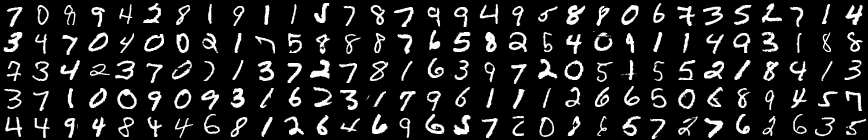

# MNIST for Numpy



The MNIST database of handwritten digits has 60,000 training examples, and 10,000 test examples.
Each example included in the MNIST database is a 28x28 grayscale image of handwritten digit and its corresponding label(0-9).
This Python module makes it easy to load the MNIST database into numpy arrays.
For more details about the MNIST database, please visit [here](http://yann.lecun.com/exdb/mnist/index.html).

## Requirements

- Python 3.x
- Numpy

## Usage

First, download `mnist.py` from this repository and locate it to your working directory.
Then you can make your MNIST data to be prepared in Python as follows.

```python
import mnist

mnist.init()
```

**init()** consists of 2-steps.

1. Download the MNIST database.
2. Make it into numpy arrays and save it as Pickle. (`mnist.pkl`)

You can do this in command line tools as well.

```sh
$ python3 mnist.py
```

After preparing, you can load the MNIST database into numpy array like this.

```python
x_train, t_train, x_test, t_test = mnist.load()
```

**load()** takes `mnist.pkl` and returns 4 numpy arrays.

- x_train : 60,000x784 numpy array that each row contains flattened version of training images.
- t_train : 1x60,000 numpy array that each component is true label of the corresponding training images.
- x_test : 10,000x784 numpy array that each row contains flattened version of test images.
- t_test : 1x10,000 numpy array that each component is true label of the corresponding test images.

## Notice

Once you get `mnist.pkl`, you don't need to call **init()** anymore. Everything you need to do is to locate `mnist.py` and `mnist.pkl` in your working directory and to call **load()**.
